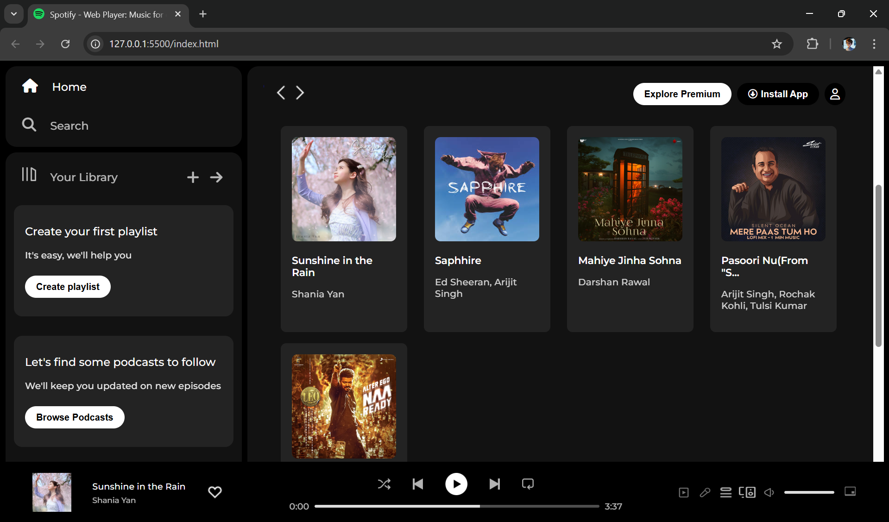

# 🎧 Spotify UI Clone (Frontend Only)

A visually rich **Spotify Web UI clone** built entirely using **HTML** and **Vanilla CSS** — no JavaScript frameworks, no backend, just pure frontend vibes.  
Built as a practice project after completing HTML & CSS and before diving into JavaScript.

---

## 📽️ Preview

https://user-images.githubusercontent.com/video_preview.mp4  


> Want a quick peek? Watch this short UI walkthrough and see the clone in action!

---

## 🚀 Features

- 🎵 Sidebar navigation (Home, Search, Your Library)
- 📚 Playlist section with cards
- 📌 Sticky navbar with user and install options
- 🎛️ Fully styled bottom music player bar
- 🎨 Font Awesome icons + Google Fonts integration
- 💡 Responsive layout using **flexbox** and modern CSS

---

## 🛠️ Tech Stack

- **HTML5**  
- **CSS3**
- **Font Awesome** (for icons)  
- **Google Fonts** (Montserrat)  

---

## 📂 Folder Structure

```bash
Spotify_Clone/
├── index.html
├── style.css
├── assets/
│   └── (all images/icons)
├── video_preview.mp4 
└── README.md

🧠 What I Learned
How to structure a music platform layout

Flexbox magic for clean alignment

Deepened CSS styling: spacing, positioning, cards, icons

UI building without relying on JavaScript

📸 Screenshot


📁 Clone This Project
bash
Copy
Edit
git clone https://github.com/dev-rohitkumar/Spotify_Clone
cd Spotify_Clone
Then open index.html in your browser.

📝 License
This project is for learning and practice purposes only.
Spotify is a trademark of Spotify AB — this is a clone for educational/demo use only.

🙋‍♂️ Author
Rohit Kumar
🌐 LinkedIn | GitHub

⭐ Don’t forget to leave a ⭐ if you liked it!